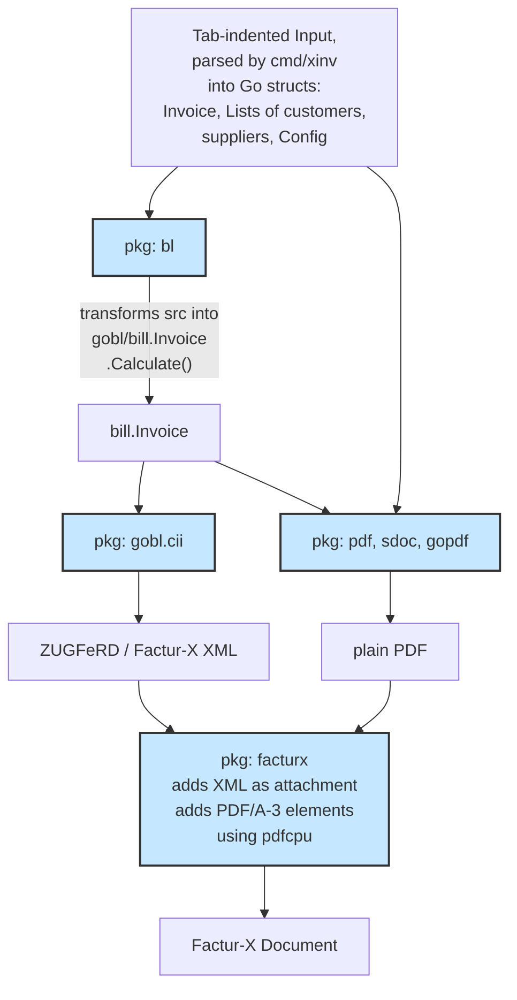

# xinv

_Xinv_ is an experimental Go module to create Factur-X/ZUGFeRD invoices,
generating the PDF and the embedded XML invoice from the same source.
Its features are limited to what appears necessary from the perspective of a freelancer
— a proof of concept rather than a production-ready solution.
The module wraps other Go modules that do most of the work:

- [GOBL] provides the calculation of taxes and bill totals, and the generation of x-invoices in Factur-X/ZUGFeRD format (the XML).

- [gopdf]¹ is used to create a PDF invoice, from the same data as the x-invoice.

- [pdfcpu]² is used to attach the x-invoice to the generated PDF.

¹ slightly adjusted to generate PDF/A-3 compliant font metadata  
² adjusted for deterministic output

## Structure 
_Xinv_ consists of the following sub-packages:

-	`bl`: a wrapper around GOBL, providing simplified `Invoice`, `Party`, and `Address` types

-	`facturx`: combines a PDF document and an XML invoice into
	one document.
	Additionally, it embeds XMP meta information, and sets an
	output intent required by PDF/A-3.

-	`pdf`: a utility package helping to create simple invoices from a `bl.Invoice`.
	It provides an embedded Arimo font.

-	`sdoc`: a simple text formatting package to be used with `pdf`, with an interface inspired
	by _troff_.

-	`cmd/xinv`: a minimal command line tool to create Factur-X/ZUGFeRD PDF documents
	based on simple tab-indented input files for invoice data (invoice, customers, suppliers, document
	texts).

## Data Flow

## Usage

`cmd/xinv` expects config files in subdirectory `./config`, or the
directory specified with option -C.
Config files are text files containing tab-indented key-value pairs.
`cmd/xinv` takes the name of the invoice source file as an argument:

    ./xinv -o invoice.pdf invoice

See `cmd/xinv/example` for an example configuration:

	./xinv -o example.pdf -C example/config example/invoice

## Validation

To validate the resulting PDF, you can use [Mustang-CLI]:

	java -jar Mustang-CLI.jar --action validate --source invoice.pdf

As an alternative, the FNFE-MPE (Forum National de la Facture Électronique et des Marchés Publics Électroniques) provides a validation
service at <https://services.fnfe-mpe.org/>.
